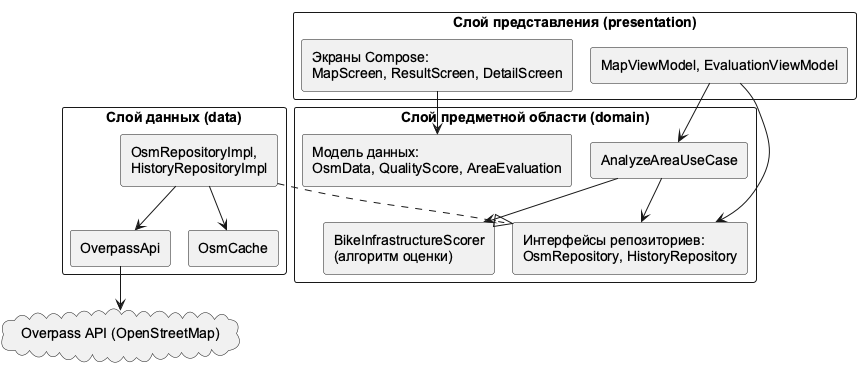
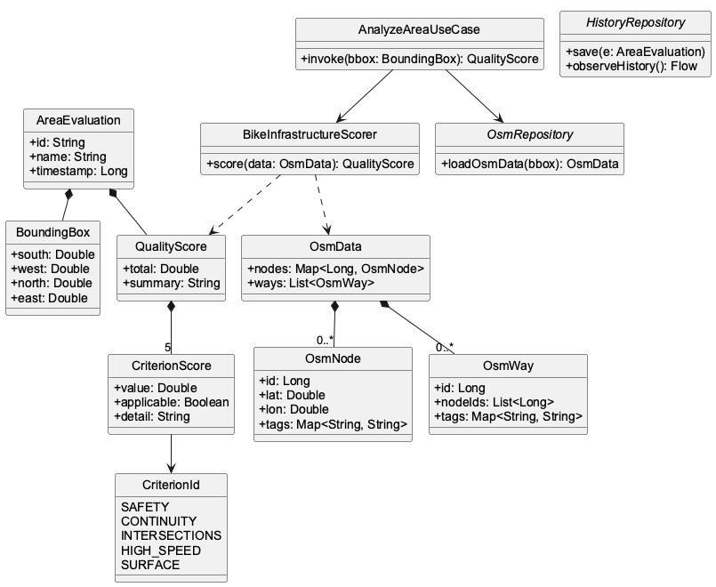
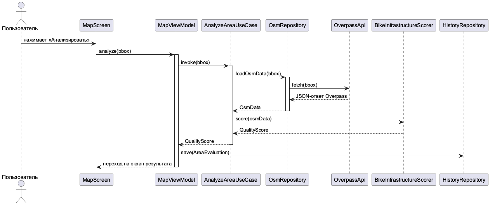

# Анализатор качества велосипедной инфраструктуры


> Мобильное приложение для Android, выполняющее автоматизированную оценку качества
> велосипедной инфраструктуры в выбранной области по открытым данным OpenStreetMap.

Курсовая работа по дисциплине «Мобильная разработка», РУТ (МИИТ).

## О проекте

Существующие велосипедные приложения — навигаторы и трекеры — отвечают на вопрос
«как доехать», но не на вопрос «насколько район в целом пригоден для велосипеда».
Это приложение закрывает пробел: для выбранной на карте территории оно
автоматически рассчитывает интегральную оценку качества велосипедной инфраструктуры.

Модель оценки ориентирована на начинающих и повседневных велосипедистов, для которых
ключевыми факторами являются безопасность движения и связность маршрутов. Все расчёты
выполняются на устройстве; обращение к сети требуется только для получения
картографических данных.

## Возможности

- Интерактивная карта OpenStreetMap; область анализа задаётся рамкой
- Автоматический расчёт интегральной оценки Q в диапазоне [0; 1] с текстовым пояснением
- Детализация результата по пяти критериям модели
- История расчётов и сравнение районов между собой
- Кэширование данных OSM — повторный анализ без обращения к сети
- Полностью автономная работа, без серверной части

### Экраны

| Экран | Назначение |
|---|---|
| Карта | Выбор области анализа, история расчётов |
| Результат | Итоговая оценка Q, пояснение, похожие районы |
| Детализация | Частные оценки по каждому из пяти критериев |

## Модель оценки

Интегральный показатель качества вычисляется как взвешенная сумма пяти
нормализованных критериев:

**Q = 0.30·S + 0.25·N + 0.25·I + 0.15·V + 0.05·P**

| Критерий | Обозн. | Вес | Что измеряет |
|---|:---:|:---:|---|
| Безопасность | S | 0.30 | Доля комфортной (низкострессовой) сети |
| Непрерывность | N | 0.25 | Связность низкострессовой сети |
| Перекрёстки | I | 0.25 | Доля организованных пересечений |
| Скоростные дороги | V | 0.15 | Обеспеченность велоинфраструктурой дорог свыше 40 км/ч |
| Покрытие | P | 0.05 | Доля объектов с приемлемым покрытием |

Критерий безопасности учитывает не только выделенные велодорожки, но и спокойные
улицы (низкая разрешённая скорость, жилые зоны) и дороги с параллельными
велодорожками — то есть всю «низкострессовую» сеть, комфортную для начинающего
велосипедиста. Если для критерия недостаточно данных, он исключается из расчёта с
нормировкой весов оставшихся критериев.

Примеры оценок по реальным данным OpenStreetMap:

| Территория | Q | Качество |
|---|:---:|---|
| Центр Амстердама | 0.86 | высокое |
| Центр Копенгагена | 0.81 | высокое |
| Парк Горького, Москва | 0.54 | среднее |
| Жилой район, Москва | 0.33 | низкое |

## Архитектура

Приложение построено по принципам **Clean Architecture** (три слоя) в сочетании с
паттерном **MVVM**. Слой предметной области не зависит от платформы Android и
сторонних библиотек.



- **domain** — модель предметной области, алгоритм оценки, сценарии использования,
  интерфейсы репозиториев;
- **data** — получение данных OpenStreetMap через Overpass API, кэширование,
  история расчётов;
- **presentation** — экраны на Jetpack Compose и классы ViewModel.

### Диаграмма классов доменной модели



### Сценарий анализа территории



## Технологии

- **Язык:** Kotlin
- **Интерфейс:** Jetpack Compose, Material 3
- **Карта:** osmdroid
- **Сеть:** OkHttp (Overpass API), Gson
- **Асинхронность:** Kotlin Coroutines
- **Архитектура:** Clean Architecture, MVVM, ручной Dependency Injection
- **Тестирование:** JUnit, Jetpack Compose UI Test

## Структура проекта

```
app/src/main/java/com/example/courseproject/
├── CourseProjectApp.kt      инициализация приложения и osmdroid
├── MainActivity.kt          точка входа
├── di/                      контейнер зависимостей
├── domain/                  слой предметной области
│   ├── model/               модели данных
│   ├── repository/          интерфейсы репозиториев
│   ├── analysis/            алгоритм оценки, геометрия, Union-Find
│   └── usecase/             сценарии использования
├── data/                    слой данных
│   ├── remote/              клиент Overpass API
│   ├── mapper/              преобразование DTO в доменную модель
│   ├── cache/               файловый кэш данных OSM
│   └── repository/          реализации репозиториев
└── presentation/            слой представления
    ├── map/                 экран карты
    ├── result/              экран результата
    ├── detail/              экран детализации
    ├── evaluation/          ViewModel результата и детализации
    ├── components/          переиспользуемые UI-компоненты
    └── navigation/          навигация между экранами
```

## Сборка и запуск

Требования: Android Studio, JDK 17+, Android SDK.

```bash
git clone https://github.com/Alectobe/bicycle-infrastructure-analyzer.git
```

Открыть проект в Android Studio и запустить на эмуляторе или устройстве. Для работы
карты и загрузки данных нужен доступ в интернет.

Сборка APK из консоли:

```bash
./gradlew assembleDebug
```

## Тестирование

Модульные тесты (выполняются на JVM):

```bash
./gradlew test
```

Покрыты доменный слой и алгоритм оценки: расчёт критериев, поиск параллельных
велодорожек, система непересекающихся множеств, геометрические расчёты, сценарий
анализа территории.

UI-тест экрана результата (требуется эмулятор или устройство):

```bash
./gradlew connectedDebugAndroidTest
```

## Документация

UML-диаграммы архитектуры — в каталоге [`docs/uml`](docs/uml). Проект сопровождается
пояснительной запиской с анализом предметной области, требованиями, проектированием
интерфейса и описанием программной реализации.

---

Учебный проект · РУТ (МИИТ) · 2026
